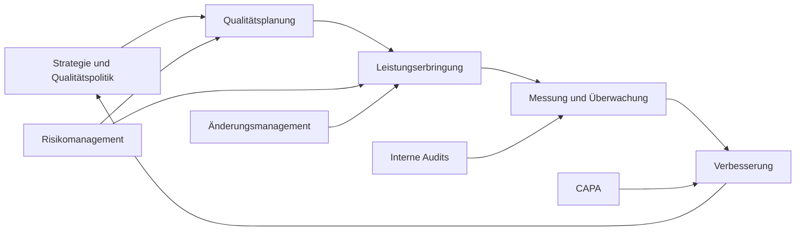

# QMS-Handbuch

## Zweck

Dieses Handbuch beschreibt Aufbau, Geltungsbereich und Steuerung des Qualitätsmanagementsystems. Es verbindet die QMS-Dokumente zu einem nachvollziehbaren Prozessmodell und dient als Einstiegspunkt für Mitarbeitende, Auditoren und Führungskräfte.

## Geltungsbereich

Das QMS gilt für alle Tätigkeiten, die Qualität, Sicherheit, Zuverlässigkeit, Kundenzufriedenheit oder regulatorische Konformität der bereitgestellten Produkte und Dienstleistungen beeinflussen. Nicht zutreffende Anforderungen müssen begründet, dokumentiert und mindestens jährlich überprüft werden.

## Prozessmodell

## Rollen und Verantwortlichkeiten

| Rolle | Verantwortung |
| --- | --- |
| Geschäftsführung | Qualitätspolitik freigeben, Ressourcen bereitstellen, Managementbewertungen durchführen. |
| QMS-verantwortliche Person | QMS pflegen, Dokumentenlenkung steuern, Audits und CAPAs koordinieren. |
| Prozessverantwortliche | Prozesse beschreiben, Kennzahlen überwachen, Risiken und Änderungen bewerten. |
| Mitarbeitende | Freigegebene Prozesse anwenden, Abweichungen melden, Schulungen absolvieren. |

## Kernprozesse

| Prozess | Eingaben | Ergebnisse | Verknüpfte Dokumente |
| --- | --- | --- | --- |
| Qualitätsplanung | Strategie, Kundenanforderungen, Risiken | Qualitätsziele, Maßnahmenplan | [Qualitätspolitik](./quality-policy.md), [Risikomanagement](./risk-management.md) |
| Leistungserbringung | Anforderungen, freigegebene Prozesse | Produkte, Services, Nachweise | [Dokumentenlenkung](./document-control.md), [Schulung](./training.md) |
| Überwachung | Kennzahlen, Audits, Feedback | Auditberichte, Abweichungen, Trends | [Interne Audits](./internal-audits.md), [CAPA](./capa.md) |
| Verbesserung | Ursachenanalysen, Lessons Learned | CAPAs, Prozessänderungen | [CAPA](./capa.md), [Änderungsmanagement](./change-management.md) |

## Managementbewertung

Die Geschäftsführung bewertet das QMS mindestens jährlich. Eingaben sind Qualitätsziele, Auditresultate, CAPA-Status, Kundenfeedback, Prozesskennzahlen, Änderungen, Risiken, Ressourcenbedarf und Verbesserungsvorschläge. Ergebnisse sind Entscheidungen, Maßnahmen, Verantwortliche und Fristen.

## Wirksamkeitsmessung

Das QMS gilt als wirksam, wenn definierte Qualitätsziele verfolgt werden, kritische Risiken kontrolliert sind, CAPAs fristgerecht abgeschlossen werden, Audits durchgeführt werden und Mitarbeitende für ihre Aufgaben qualifiziert sind.
